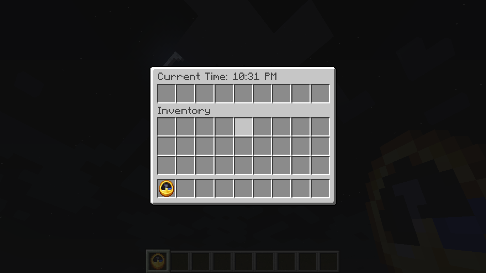

# Clock-GUI Plugin

**Clock-GUI** is a Minecraft plugin that enhances the in-game clock by providing a quick-access GUI. When players right-click with a clock in hand, they are presented with a minimal interface displaying the current in-game time in a **12-hour format**.



## Features

- **12-Hour Time Format**: Displays the current in-game time as `HH:MM AM/PM`, calculated from Minecraft's internal day-night cycle.
- **Quick Access**: Right-click with a clock to open the GUI and view the current time instantly.
- **Minimal GUI**: A lightweight and intuitive interface that doesn't clutter the gameplay experience.

## Requirements

To build and run this plugin, you will need:

- Git
- JDK (Java Development Kit) 21.0.4 or higher
- Gradle 8.10.1 or higher

## Installation Guide

### Build from Source

1. **Clone the Repository**  
   Clone the project repository from GitHub:
   ```bash
   git clone https://github.com/beduality/clock-gui
   cd clock-gui
   ```

2. **Build the Plugin**  
   Run the following command to build the plugin:
   ```bash
   gradle build
   ```

3. **Locate the Built Plugin**  
   The compiled plugin will be located at `build/libs/clockgui-1.0.0.jar`.

4. **Add to Your Server**  
   Move the `clockgui-1.0.0.jar` file into the `plugins` folder of your Minecraft server.

5. **Start the Server**  
   Restart your server if it's already running. The plugin will automatically enable itself.

6. **Verify Installation**  
   Check your server logs for the message:  
   ```
   [ClockGUI] Clock-GUI Plugin Enabled
   ```

## Usage

1. Hold a clock in your hand.
2. Right-click while holding the clock.
3. A GUI will open displaying the current in-game time in **12-hour format**.

### Example:

If the in-game time is 4500 ticks, the plugin will display:  
```
Current Time: 09:45 AM
```

## Configuration

No additional configuration is required! The plugin works out of the box.

## Compatibility

- **Minecraft Version**: 1.20 or higher
- **API**: Built using the Bukkit/Spigot API.

## Contribution

We welcome contributions!  
Feel free to fork the project, submit pull requests, or report issues on our [GitHub repository](https://github.com/beduality/clock-gui).
