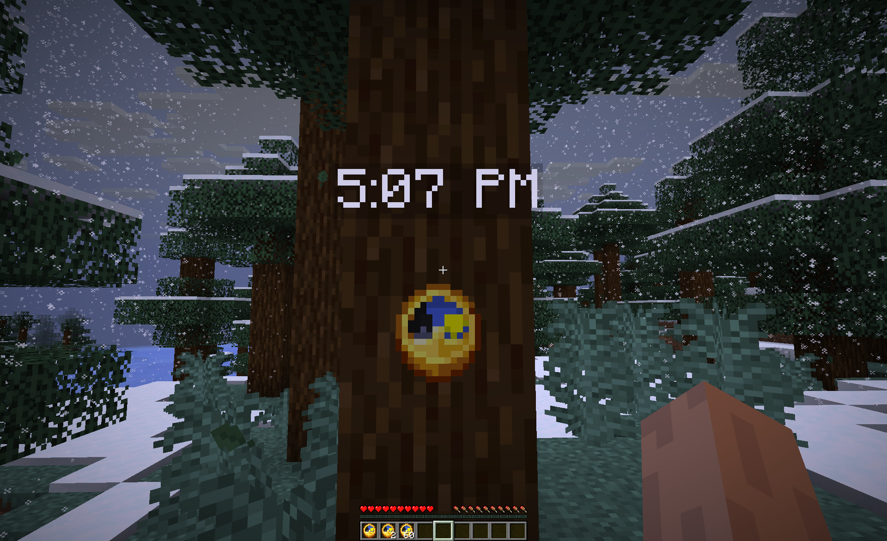

# ClockTime

[Docs](https://beduality.github.io/clock-time/) | [Javadoc](https://beduality.github.io/clock-time/apidocs/) | [Hangar](https://hangar.papermc.io/beduality/clock-time) | [Modrinth](https://modrinth.com/plugin/clock-time) | [MIT License](./LICENSE)

ClockTime is a multi-platform Minecraft plugin and mod written in Java, designed to bring localized, client-side formatted in-game time displays to players. Built on clean architecture principles, the repository separates platform-agnostic domain logic from specific loader platform implementations.

---

## Repository Structure

The codebase is organized as a multi-project Gradle build under the `modules/` directory:

- **[clock-time-common](file:///home/luis/GitHub/beduality/clock-time/modules/clock-time-common)**: Pure Java domain layer containing tick-to-time math, dimension resolvers, and core translation properties files. No platform-specific dependencies.
- **[clock-time-paper](file:///home/luis/GitHub/beduality/clock-time/modules/clock-time-paper)**: Paper/Spigot adapter handling configuration, event handling, command registration, and Bukkit integrations.
- **[clock-time-fabric](file:///home/luis/GitHub/beduality/clock-time/modules/clock-time-fabric)**: Fabric loader adapter implementing events and environment integrations.

Detailed architectural analysis can be found in the [Architecture Explanation](https://beduality.github.io/clock-time/developers/explanation/architecture/).

---

## Developer & Contributor Resources

To avoid redundant information, please refer directly to the canonical files and documentation pages:

- **Code Style & Development Workflow**: See [CONTRIBUTING.md](file:///home/luis/GitHub/beduality/clock-time/CONTRIBUTING.md) for guidelines on JDK versions, build/test commands (`./gradlew build`), code formatting (Spotless), and pulling request workflows.
- **Local Documentation Setup**: Instructions on running the documentation server using `uv` and `mkdocs` are located in [CONTRIBUTING.md](file:///home/luis/GitHub/beduality/clock-time/CONTRIBUTING.md#documentation).
- **Dependency Integration**: Learn how to declare ClockTime as a Gradle or Maven dependency in the [Dependency Configuration Guide](https://beduality.github.io/clock-time/developers/how-to-guides/dependency-setup/).
- **API Reference**: Look up Javadocs and programmatical queries in the [API reference](https://beduality.github.io/clock-time/developers/reference/api/).
- **Release Guidelines**: Version numbers bump, changelog rules, and release tags publishing are detailed in [CONTRIBUTING.md](file:///home/luis/GitHub/beduality/clock-time/CONTRIBUTING.md#release-process).
- **Licensing**: This project is licensed under the MIT License; see [LICENSE](file:///home/luis/GitHub/beduality/clock-time/LICENSE).
