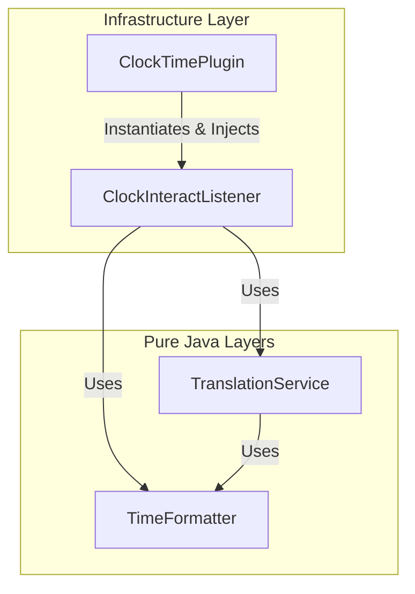
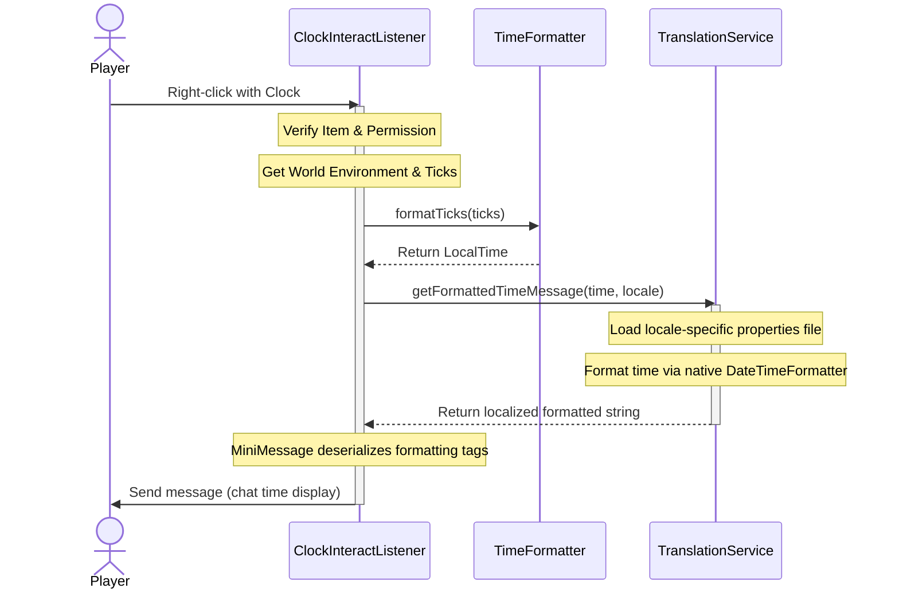

# Architecture

This project strictly adheres to **Clean Architecture** principles to separate core business/translation logic from the Minecraft server API (Paper API). This makes components highly testable, modular, and maintainable.

---

## Architectural Layout

### 1. Domain Layer (`io.github.beduality.clock_time.domain`)
* **Role**: Houses pure business rules and calculations.
* **Dependencies**: None. Pure Java library.
* **Key Components**:
  * `TimeFormatter`: Translates abstract Minecraft ticks (0-24000) to standard `java.time.LocalTime` objects.

### 2. Application Layer (`io.github.beduality.clock_time.application`)
* **Role**: Implements application-specific logic like localization, message compilation, and configuration coordination.
* **Dependencies**: Domain layer, Java standard library (e.g. `java.util.ResourceBundle`). Does not depend on the Bukkit API.
* **Key Components**:
  * `TranslationService`: Resolves messages using resources loaded via a ClassLoader, handling client locales and custom fallback rules.

### 3. Infrastructure Layer (`io.github.beduality.clock_time.infrastructure` / plugin root)
* **Role**: Integrates the plugin with the Minecraft server platform (Paper/Bukkit).
* **Dependencies**: Paper API, Domain layer, Application layer.
* **Key Components**:
  * `ClockTimePlugin`: Plugin lifecycle manager. Configures services and constructs dependencies via manual dependency injection.
  * `ClockInteractListener`: Event listener handling player click actions, permission validation, and Minecraft world state inspections.

---

## Request Flow Diagram

When a player right-clicks with a clock:

