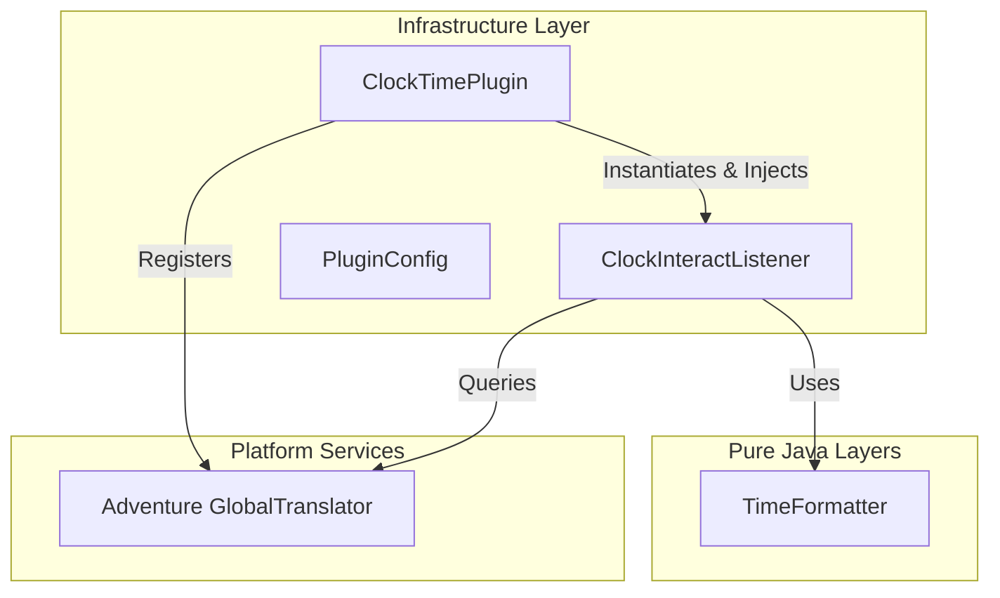
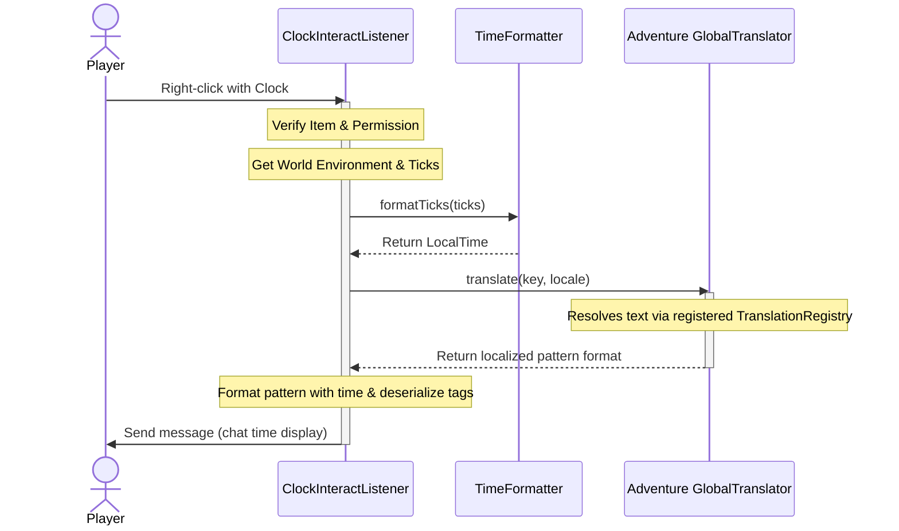

# Architecture

This project strictly adheres to **Clean Architecture** principles to separate core business/time formatting logic from the Minecraft server API (Paper API). This makes components highly testable, modular, and maintainable.

---

## Architectural Layout

### 1. Domain Layer (`io.github.beduality.clock_time.domain`)

* **Role**: Houses pure business rules and calculations.
* **Dependencies**: None. Pure Java library.
* **Key Components**:
  * `TimeFormatter`: Translates abstract Minecraft ticks (0-24000) to standard `java.time.LocalTime` objects.

### 2. Infrastructure Layer (`io.github.beduality.clock_time.infrastructure` / plugin root)

* **Role**: Integrates the plugin with the Minecraft server platform (Paper/Bukkit) and third-party libraries (SpongePowered Configurate).
* **Dependencies**: Paper API, Domain layer, Configurate.
* **Key Components**:
  * `ClockTimePlugin`: Plugin lifecycle manager and Composition Root. Sets up the configuration using Configurate and registers translations to Adventure's `GlobalTranslator`.
  * `PluginConfig`: Maps YAML settings to a typed config class.
  * `ClockInteractListener`: Event listener handling player click actions, permission validation, and querying Adventure for localized translations.

---

## Request Flow Diagram

When a player right-clicks with a clock:

