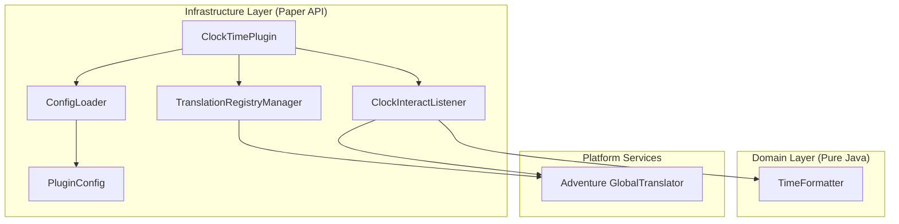
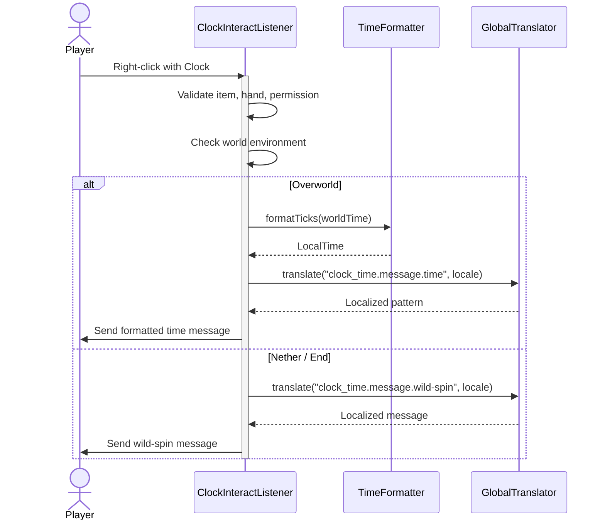

# Architecture

ClockTime follows **Clean Architecture** principles to separate business logic from platform-specific code.

## Layer Overview

### Domain Layer

**Package:** `io.github.beduality.clock_time.domain.service`

Pure Java with zero external dependencies. Contains the core tick-to-time conversion logic.

| Class | Responsibility |
|---|---|
| `TimeFormatter` | Converts Minecraft ticks (0–24000) to `java.time.LocalTime` |

### Infrastructure Layer

**Package:** `io.github.beduality.clock_time.infrastructure.*`

Bridges the domain layer with Paper API, Configurate, and Kyori Adventure.

| Class | Responsibility |
|---|---|
| `ClockTimePlugin` | Plugin entry point and composition root |
| `ConfigLoader` | Loads, validates, and migrates `config.yml` using Configurate |
| `TranslationRegistryManager` | Extracts `.properties` files from the JAR, creates a custom ClassLoader, and registers translations with Adventure's `GlobalTranslator` |
| `ClockInteractListener` | Handles right-click events, validates permissions, and sends localized chat messages |
| `PluginConfig` | Typed configuration mapping via Configurate's `@ConfigSerializable` |

## Request Flow

## Design Decisions

**Why decouple `TimeFormatter`?**

:   The tick-to-time math is pure arithmetic with no Bukkit dependencies. Keeping it in a separate domain layer makes it unit-testable without mocking any server APIs.

**Why use Adventure's `GlobalTranslator`?**

:   Paper natively supports Adventure components. By registering translations globally, any plugin or component can resolve ClockTime messages without direct coupling.

**Why extract `.properties` to the data folder?**

:   This allows server administrators to edit translations without touching the JAR. The custom `URLClassLoader` ensures the external files take priority over bundled resources.
