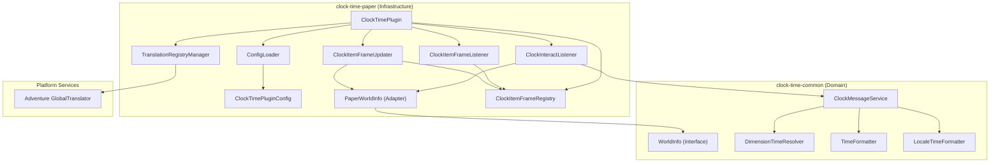
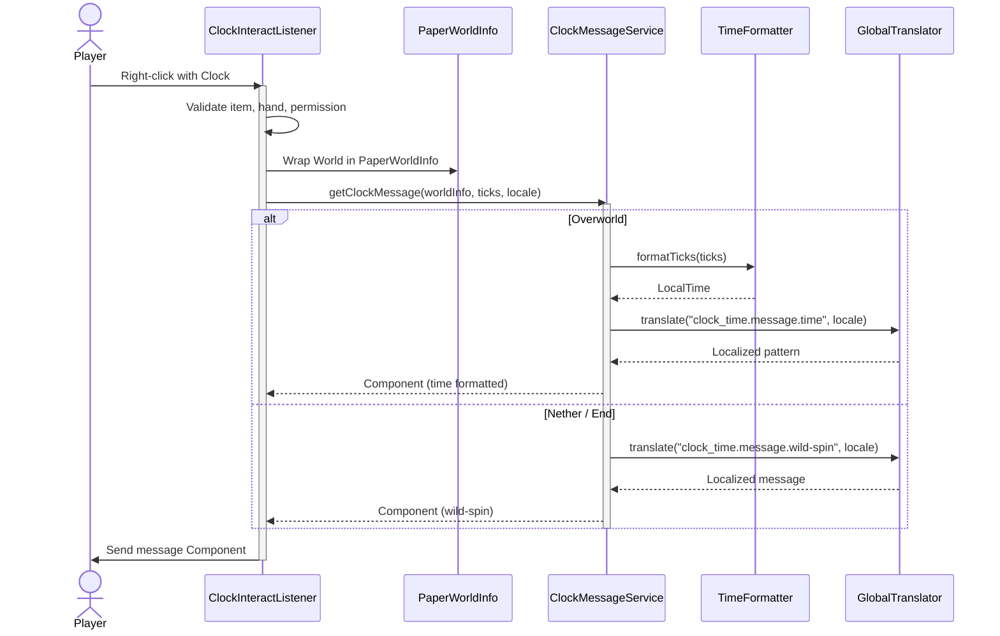

# Architecture

ClockTime follows **Clean Architecture** principles to separate business logic from platform-specific code. With the multi-module project structure, the codebase is strictly separated into platform-agnostic domain logic and platform-specific infrastructure adapters.

## Layer & Module Overview

### Domain Module (`clock-time-common` under `modules/clock-time-common`)

**Package:** `io.github.beduality.clock_time.domain.*`

Pure Java with zero platform dependencies (depends only on standard Java APIs and Kyori Adventure). Contains the core tick-to-time conversion logic, dimension resolvers, localized message builder service, and standard translation bundles.

| Package / Class | Responsibility |
|---|---|
| `domain.model.WorldInfo` | Platform-agnostic interface representing world name, dimension key, and environment type |
| `domain.service.TimeFormatter` | Converts Minecraft ticks (0–24000) to `java.time.LocalTime` |
| `domain.service.LocaleTimeFormatter` | Formats `LocalTime` using localized short time patterns |
| `domain.service.DimensionTimeResolver` | Determines if a world/dimension has custom configurations or wild-spinning time (e.g. Nether/End) |
| `domain.service.ClockMessageService` | Coordinates formatting and translation to build the final Adventure component |

### Paper Module (`clock-time-paper` under `modules/clock-time-paper`)

**Package:** `io.github.beduality.clock_time.infrastructure.*` and root package `io.github.beduality.clock_time`

Bridges the domain module with the Paper API, Configurate-Yaml, and Kyori Adventure.

| Class | Responsibility |
|---|---|
| `ClockTimePlugin` | Plugin entry point and composition root bootstrapping dependencies |
| `infrastructure.adapter.PaperWorldInfo` | Adapter wrapping Bukkit's `World` to implement the domain `WorldInfo` interface |
| `infrastructure.manager.ConfigLoader` | Loads, validates, and migrates `config.yml` using Configurate |
| `infrastructure.manager.TranslationRegistryManager` | Extracts `.properties` files from JAR, loads bundles, and binds translation keys to Adventure's `GlobalTranslator` |
| `infrastructure.listener.ClockInteractListener` | Handles right-click events, validates permissions, and delegates time messages using `PaperWorldInfo` |
| `infrastructure.listener.ClockItemFrameListener` | Monitors chunk loading/unloading and placement to register/unregister clock frames |
| `infrastructure.manager.ClockItemFrameRegistry` | In-memory registry tracking loaded item frames that contain clocks |
| `infrastructure.manager.ClockItemFrameUpdater` | Task scheduler that updates clock displays when the Minecraft minute changes |
| `infrastructure.config.ClockTimePluginConfig` | Typed configuration mapping via Configurate's `@ConfigSerializable` |

## Request Flow

## Design Decisions

**Why restructure as a multi-module project?**

:   By splitting the codebase into a core module (`clock-time-common` under `modules/clock-time-common`) containing only pure Java domain code and an infrastructure module (`clock-time-paper` under `modules/clock-time-paper`), the codebase is prepared to support other platform targets (like Fabric, NeoForge, etc.) in the future without duplicating business logic, properties, or formatter math.

**Why decouple `org.bukkit.World` using `WorldInfo`?**

:   Direct references to `org.bukkit.World` in the domain layer would leak Bukkit dependencies, preventing the reuse of domain services in Fabric/NeoForge. Abstracting world dimensions behind the `WorldInfo` interface allows each modding/plugin platform to provide its own lightweight adapter class.

**Why always load default translations from the classpath?**

:   While production servers extract language properties to files for custom editing, test/development environments (like MockBukkit) run without fully packed JAR archives where zip extraction fails. Adding all default supported locales to `localesToLoad` dynamically ensures the plugin loads fallback properties directly from the classpath/resource bundles.

**Why is the item frame clock update system event-driven and cached?**

:   Scanning all entities in all worlds or chunks periodically is extremely expensive and causes server lag. Instead, we use `ClockItemFrameListener` to dynamically register/unregister frames upon chunk loading, player interactions, and entity damage, saving them into `ClockItemFrameRegistry`. To keep CPU cycles near zero, `ClockItemFrameUpdater` runs every 16 ticks (the duration of a Minecraft minute) and compares the in-game minute with a cached timestamp. If the minute has not changed, it skips updating the item metadata.

