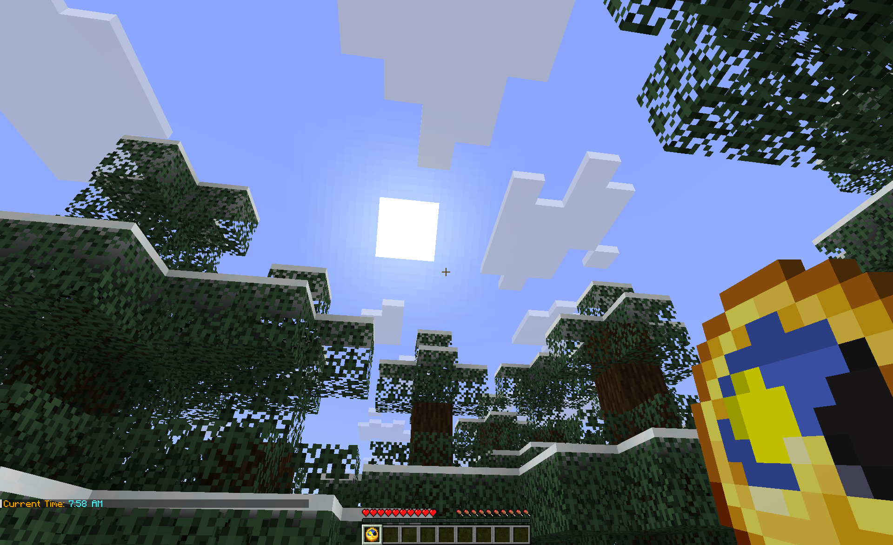
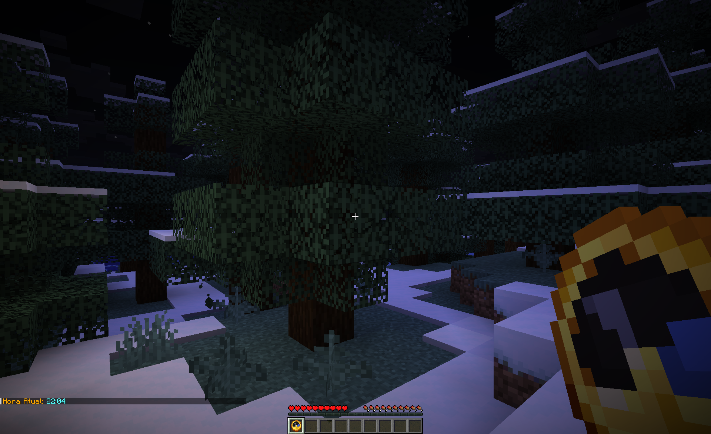
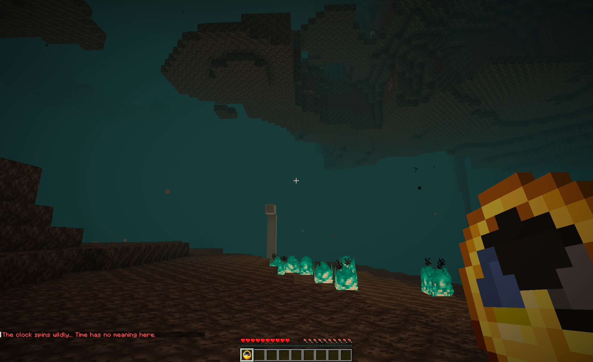

# ClockTime

A lightweight Minecraft plugin that enhances the in-game clock with localized, customizable time displays.

---

-   :material-clock-outline:{ .lg .middle } __Localized Time__

    ---

    Automatically formats time using each player's client language — including native AM/PM symbols.

    [:octicons-arrow-right-24: Quick start](server-admins/tutorials/installation.md)

-   :material-translate:{ .lg .middle } __Dynamic Translations__

    ---

    Ships with 16+ built-in languages, and scans the `languages/` folder for any custom translation files (`messages_*.properties`) added by administrators.

    [:octicons-arrow-right-24: Translations](server-admins/how-to-guides/translations.md)

-   :material-cog-outline:{ .lg .middle } __Zero Configuration__

    ---

    Drop the JAR into `plugins/` and go. Easily configure fallback options or register custom wild-spin worlds.

    [:octicons-arrow-right-24: Configuration](server-admins/reference/settings.md)

-   :material-compass-off-outline:{ .lg .middle } __Dimension Aware__

    ---

    Detects Nether, End, or custom configured dimensions where time doesn't exist and shows a special message instead of broken values.

    [:octicons-arrow-right-24: Quick start](server-admins/tutorials/installation.md)

## How It Works

1. A player holds a **Clock** :material-clock: in their main hand.
2. They **right-click**.
3. The current in-game time appears in chat, formatted in their language.

=== "Day Demo"

    

=== "Night Demo"

    

=== "Nether Demo"

    

!!! example "What the player sees (Text Format)"

    === "English"

        Current Time: 2:30 PM

    === "Spanish"

        Hora Actual: 14:30

    === "Japanese"

        現在の時刻: 午後2:30

!!! note "Nether, End & Custom Dimensions"

    In dimensions where time doesn't exist (Nether, The End, or custom dimensions configured in `config.yml`), the clock shows a special message:

    The clock spins wildly... Time has no meaning here.

## Requirements

| Component | Version |
|---|---|
| Minecraft Server | Paper, Purpur, or compatible fork |
| API Version | 1.20+ |
| Java | 21+ |

## Links

- [:fontawesome-brands-github: GitHub](https://github.com/beduality/clock-time)
- [:fontawesome-brands-discord: Discord](https://discord.gg/D5meCv2Wnd)
