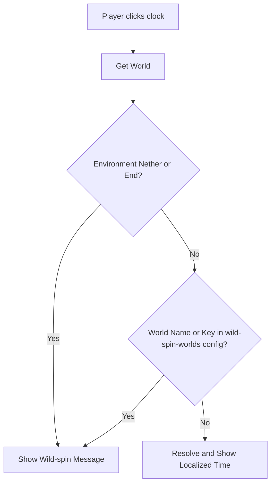

# Dimension Awareness

This page explains how the ClockTime plugin resolves dimensions and decides whether to show the current time or a wild-spin message.

## How Dimension Resolution Works

When a player right-clicks a clock, the plugin determines the behavior of the clock based on the environment and name/key of the world they are currently in.

### 1. Default Wild-Spin Environments

By default, Minecraft's Nether (`NETHER`) and End (`THE_END`) environments do not have standard day/night cycles, and standard clocks spin wildly. ClockTime detects these environments automatically and displays a localized wild-spin message (e.g., *The clock spins wildly... Time has no meaning here.*).

### 2. Custom & Modded Dimensions

Administrators on modern servers can create custom dimensions using datapacks, resulting in the `CUSTOM` world environment. Additionally, modded servers may introduce unique environments. 

To handle these dimensions gracefully, ClockTime allows administrators to designate specific world names or namespaced keys to treat as wild-spin dimensions in the `config.yml` via the `wild-spin-worlds` option:

- **World Name Match**: Matches against the name of the world folder (e.g., `custom_nether`).
- **Namespaced Key Match**: Matches against the namespaced dimension identifier (e.g., `custom:space` or `modded:twilight_forest`).

If a match is found in the configuration list, the clock will display the wild-spin message. Otherwise, it will fallback to normal time resolution.
