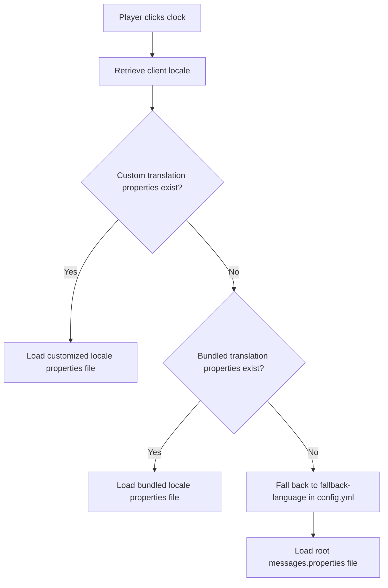

# Language Resolution

This page explains how the ClockTime plugin determines which translation file to use when a player checks the time.

## The Resolution Lifecycle

When a player triggers a clock, ClockTime resolves their locale using a step-by-step fallback chain:

### 1. Client Language Detection

Minecraft sends the player's client language code (e.g., `en_us`, `pt_br`, `zh_tw`) to the server. ClockTime captures this setting dynamically for every click request.

### 2. Custom Translations Check

On server startup, ClockTime dynamically scans the `plugins/ClockTime/languages/` directory for any properties files following the `messages_<locale>.properties` pattern (e.g., `messages_sv.properties` or `messages_pt_BR.properties`). Any detected locales are dynamically registered to the translation registry.

When a player checks the time, the plugin resolves their language code from this registered set. If a matching custom properties file was registered at startup, those customized definitions are loaded.

!!! note "Restart Required for New Translation Files"

    Because the translation registration scan occurs during plugin initialization (on startup), any newly added translation files will not be recognized until the server is restarted or the plugin is reloaded.

### 3. Bundled Translations Check

If no custom properties file exists for the detected locale, the plugin checks its internal resource bundles for the corresponding bundled language (e.g., German, Spanish, Japanese, etc.).

### 4. Configured Fallback

If neither custom nor internal translations exist for the player's locale, ClockTime references the `fallback-language` key configured in `config.yml` (default: `en`) and serves that translation bundle.
