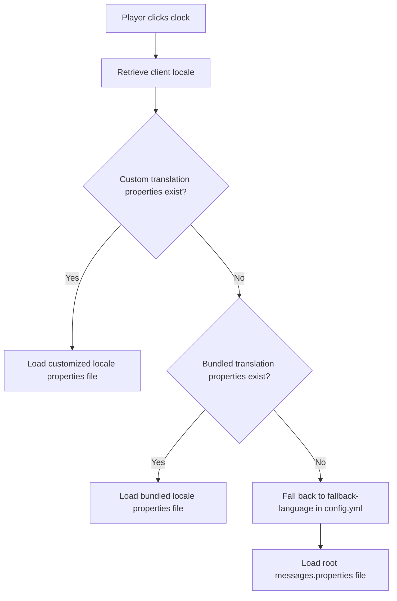

# Language Resolution

This page explains how the ClockTime plugin determines which translation file to use when a player checks the time.

## The Resolution Lifecycle

When a player triggers a clock, ClockTime resolves their locale using a step-by-step fallback chain:

### 1. Client Language Detection

Minecraft sends the player's client language code (e.g., `en_us`, `pt_br`, `zh_tw`) to the server. ClockTime captures this setting dynamically for every click request.

### 2. Custom Translations Check

The plugin checks the `plugins/ClockTime/languages/` directory for a matching custom properties file (such as `messages_pt_BR.properties` or `messages_pt.properties`). If a file exists, it uses those definitions to allow administrators to override messages.

### 3. Bundled Translations Check

If no custom properties file exists in the directory, the plugin checks its internal resource bundles for the detected locale.

### 4. Configured Fallback

If neither custom nor internal translations exist for the player's locale, ClockTime references the `fallback-language` key configured in `config.yml` (default: `en`) and serves that translation bundle.
